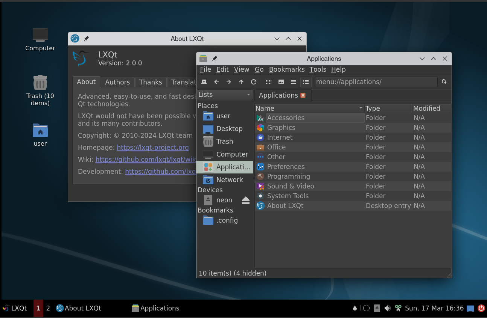

# rsp-kwin-session

>Files for an RSp Wayland session using kwin_wayland.

For taskbar, pager and showdesktop plugin support in `rsp-panel` compiling [rsp-panel-git](https://github.com/rsp/rsp-panel) is needed at the moment; [AUR](https://aur.archlinux.org/packages/rsp-panel-git) is available. There is complete wayland support in desktop, notifications, runner modules with RSp 2.0.

Use your display manager to start "RSp Kwin (Wayland)".
`startrspkwin` from tty works too.


## Screenshot



RSp style "Dark"; Palette "Valendas"

## Features

* Switch user
* Screen lock
* Full wayland support in taskbar for workspaces
* Scaling per monitor
* Window effects

## Dependencies

Build dependencies are `CMake`, rsp 2.0>= and optionally
`Git` to pull latest VCS checkouts. kwin version 6.0.2 or higher is recommended.

### Optional:

* `systemsettings` for configuring kwin
* `plasma-workspace` for configuring shortcuts, screen and else.


## Installation

Code configuration is handled by CMake.<br>
CMake variable `CMAKE_INSTALL_PREFIX` has to be set to `/usr` on most operating systems.

```
git clone https://github.com/stefonarch/rsp-kwin-session.git
cd rsp-kwin-session
mkdir build && cd build
cmake ..  -DCMAKE_INSTALL_PREFIX=/usr  -DCMAKE_BUILD_TYPE=Debug && make -j4

# Prefer creating a package for your distro instead of using sudo make install

```

## Notes and Known Issues

* Scale and language settings are imported from RSp.

* `kwin_wayland` sets a autogenerated scaling value by default if not configured under plasma, see
`~/.config/kwinoutputconfig.json` and change value in `"scale": 1,` or another matching valueeventually.

* Mouse cursor and size are synced and can be set using "Appearance" setting,
session restart required. GTK settings have to be updated after changes.

* Global shortcuts are handled only by kwin, configuration is in `~/.config/kglobalshortcutsrc`, it has to be edited if no full plasma session is installed and KDE's `systemsettings` can be used.

Qterminal's dropdown function and other commands or applications can be inserted using
`systemsettings`- it will create a `.desktop` file in `~/.local/share/applications`. Ottherwise:


``~/.config/kglobalshortcutsrc`:

```
[services][rsp-runner.desktop]
_launch=Alt+Space

[services][pcmanfm-qt.desktop]
_launch=Meta+P

[services][toggledropdown.desktop]
_launch=F12

```
Example for `~/.local/share/applications/rsp-runner.desktop`:

```
[Desktop Entry]
Exec=/bin/rsp-runner
Name=rsp-runner
NoDisplay=true
Type=Application
```


For volume keys `amixer sset Master 5%+`,`brightnessctl set 10%-` and
  `amixer sset Master toggle` can be used.
For brightness keys: `brightnessctl set +10%` and `brightnessctl set 10%-`.

* RSp session lock settings are working in `rsp-session-git`, using`loginctl lock-screen` in "Wayland Settings".
Plasma/kwin screenlocker works. To disable
screenlock add `  --no-lockscreen` to the options in `startrspkwin`.

* Bottom and right panel's tooltips and menu popups have some alignment issues
with gaps and alignment to screen border.

* Button settings in `rsp-powermanagement` are not applied yet.
  
* Some X11-only applications (example: redshift) in autostart
  could lead to high CPU usage under wayland (in git version check "Start only under x11" in autostart settings)


